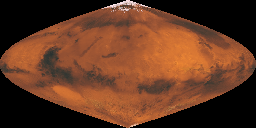
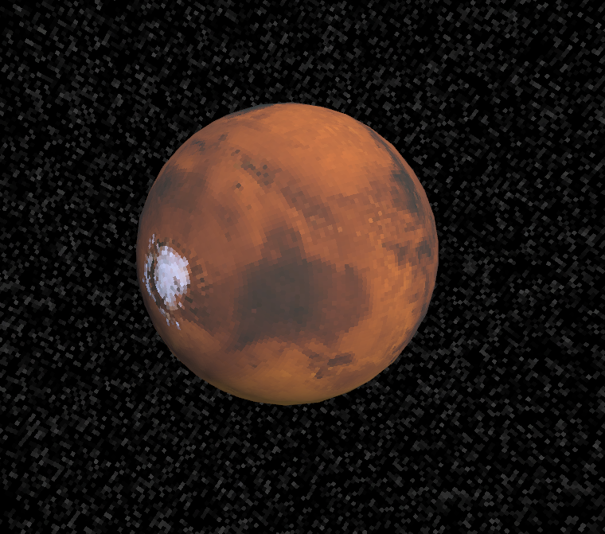
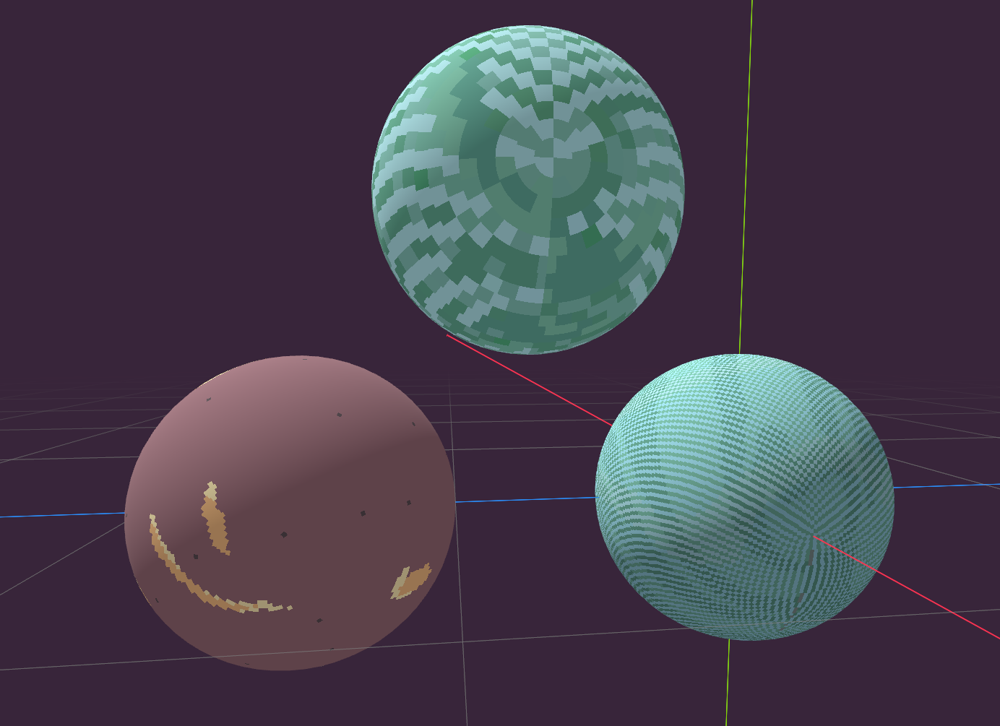
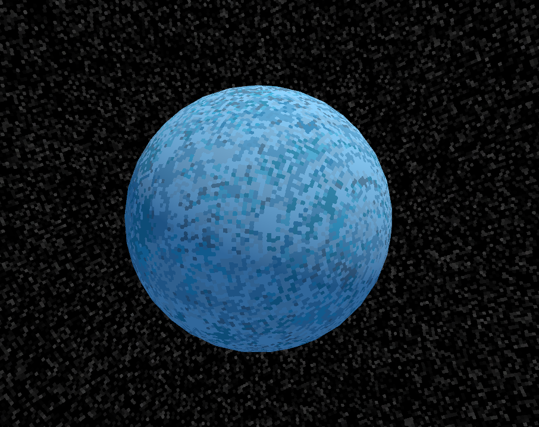

# Aseprite Sinusoidal Sphere Texture Scripts

A collection of Aseprite scripts to help with editing sinusoidal sphere textures. This is a special texture mapping that requires a custom shader to render but maps texture pixels to areas on the sphere (or sky) of constant area and aspect ratio. It's a mapping style I came up with in order to have pixely texture on sheres and skys without any distortion. It's probably not nearly as useful for high resolution textures.

The mapping is mathematically equivalent to the [Sinusoidal map projection](https://en.wikipedia.org/wiki/Sinusoidal_projection) see more details at the bottom of this README. It's an area-preserving projection, where the only distortion is skewing, which is why I've made these scripts to help editing by moving the skew.

An example texture:

What it looks like mapped to a sphere:

Feel free to use the provided example textures to test out the scripts.

## Installation

1. Open Aseprite scripts folder (`File -> Scripts -> Open Script Folder`)
2. Copy both `.lua` script files into that folder
5. If Aseprite is already open you can use `File -> Scripts -> Rescan Scripts Folder` to refresh the list so they show up.

### Sinusoidal Rotator

This script allows you to "rotate" a sinusoidal sphere texture (think rotating how the texture is mapped around the equator of the sphere) so that a different part of the texture appears in the center of the image where distortion is minimal. This makes painting and editing much easier.

**Features:**
- Interactive slider to adjust rotation (0-10000 range)
- Reset button to return to center position
- Optional automatic reset when closing the dialog

**⚠️ Warning:**
**Always reset to center before saving the image or closing the script dialog** The relative pixel alignment of rows depends on the relative rotation state, so the rotation is only reversible while the script dialog remains open. If you save or close without resetting, trying to rotate back to the old orientation will result in some rows being off by a pixel or two. The checkbox that says "Reset on close" will automatically reset the rotation when the script dialog is closed, so closing it is safe while that is checked, only uncheck it if you want to permanently rotate the texture.

**Usage:**
1. Open the script dialog from `File -> Scripts -> sinusoidal_rotator`
2. Click on the slider to rotate the texture relative to the center of the slider (you can also click and drag, this works but generates a lot of unnecessary undo steps)
3. Paint or edit on the less distorted center area
4. **Don't forget to click "Reset to Center" before saving**

### Make Sinusoid Mask

Creates a new layer with a sinusoid-shaped mask that shows the active area of the texture projection. Black pixels indicate areas outside the sinusoidal shape. Useful to help with drawing a new texture or seeing how many pixels will be on each row.

**Usage:**
1. Run the script from `File -> Scripts -> make_sinusoid_mask`
2. A new layer named "Sinusoid Mask" will be created
3. The mask will be applied to all frames in your sprite

## Notes

- The sinusoidal rotator works only on the currently active cel/layer, if it's not doing anything check your current layer
- The sinusoidal rotator works based on the size of the entire sprite, so you should be able to have separate layers and rotate them independantly, but in this case the script will not keep track of the relative rotation of each layer so be careful with that. More functionality to keep track of individual layer rotation would be possible but there's nothing for now.
- The width of each row in the sinusoidal mapping is calculated using the formula `sinusoid_width = ceil(sin(π * (row_y + 0.5) / texture_height) * texture_width)`. Rows are centered in the texture image and odd rows have the extra pixel on the left.
- Most sphere meshes have a sawtooth shaped gap in the UV space mapping because the poles are a singularity and the top and bottom faces are triangles not quads, if you have small enough faces and a low enough resolution texture any errors from that go away, but a way to avoid the problem entirely is to just use the interpolated normal direction to calculate the texture lookup. Which is what I'm doing in these screenshots.
- For best results with hard edged pixels, you probably want a sphere-voronoi style texture sampling algorithm like the one I used in the above screenshot. This is what it looks like using a rectangular nearest neighbor style:

Here's a noisy pixel texture on a blue planet showing more clearly where the voronoi sampling makes the pixel pattern look like honeycomb rather than a disco ball.

